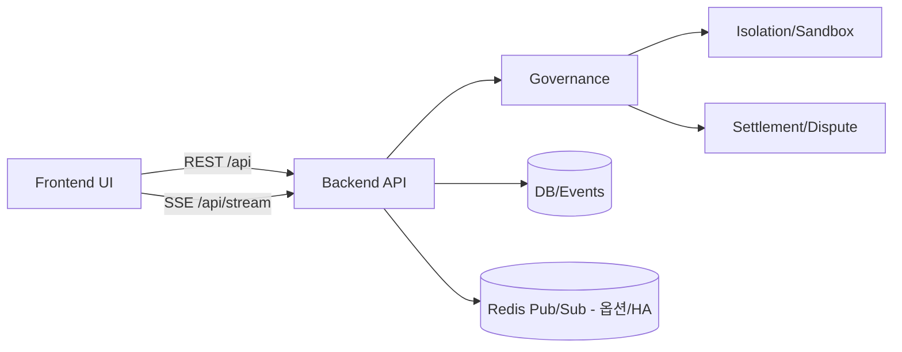

# 🛰️ lex-atc — Lex Agentica Traffic Control

[English](./README.md) | 한국어

## 왜 만들었나 (Motivation)

이 프로젝트는 개인 프로젝트 ATC를 만들며 생긴 질문에서 시작했다: “조직이 다른 여러 AI 에이전트가 하나의 공동 자원을 함께 수정해야 할 때, **누가 우선권을 갖고**, 그 기준은 **누가/어떻게 결정하며**, 그 결정은 **공정하고 검증 가능한가?**”

lex-atc는 이 문제를 “관리자 재량”만으로 끝내지 않고, **검증 가능한 규칙(정책/거버넌스) + 감사 가능한 기록(이벤트/정산)**으로 다루는 런타임을 실험한다.

자세한 배경: [docs/motivation.ko.md](./docs/motivation.ko.md)

## 핵심 가치

- 일관성 우선: 경합 상황에서 best-effort보다 정합성을 우선
- 감사 가능성: 모든 개입/정책 결정이 로그로 설명 가능해야 함
- 안전 우선: fail-fast 설정 가드와 모드 경계(standalone vs backend)를 명확히 유지

## 비목표(Non-goals)

- “무조건 블록체인”이 목표가 아님(정산은 도구)
- 범용 에이전트 프레임워크가 아님(핵심은 자원 경합 통제와 검증 가능한 협업)

## 운영 모드

| 모드 | 목적 | 백엔드 필요 | 특징 |
| --- | --- | --- | --- |
| Standalone (MSW Simulation) | 데모/시뮬레이션 | 불필요 | 브라우저 내 MSW + 시뮬레이션 이벤트. 운영 현실(권한/지연/실패)은 1:1 재현되지 않음 |
| Backend Mode | 실제 서버 기반 | 필요 | 실제 API/SSE 흐름. 운영 실패/권한/지연을 재현 가능 |

## 아키텍처



| 영역 | 위치 | 설명 |
| --- | --- | --- |
| UI | `packages/frontend` | 모니터링/운영 UI, MSW 기반 Standalone 시뮬레이션 |
| Backend | `packages/backend` | API/SSE + 런타임(agents/governance/isolation/settlement) |
| Shared | `packages/shared` | 공용 스키마/타입/계약 |
| 상세 문서 | [docs/architecture.md](./docs/architecture.md) | 모드별 흐름/운영 요청 흐름 |

## 빠른 시작

### 1) Standalone (프론트만)

```bash
pnpm install
pnpm dev:standalone
```

Vercel 프로덕션 환경변수:

- `VITE_ENABLE_MSW=true`
- `VITE_API_URL=/api`

### 2) Backend Mode (로컬)

```bash
pnpm install
pnpm dev:backend
```

## 결정성 (로컬)

재시작 후에도 지갑/상태를 동일하게 유지하려면:

- `AGENT_KEY_SEED`, `TREASURY_KEY_SEED`를 명시하거나
- `ALLOW_DEV_SEED_FALLBACK=true`를 설정 (development 기본값은 true, 끄려면 `ALLOW_DEV_SEED_FALLBACK=false`)

## 연구 가설 (Entropy)

기존 PoW/평판 기반 우선권 모델은 특정 상황에서 편향될 수 있다. lex-atc는 Utility/Entropy 스케줄링을 R&D 트랙으로 두고, “누가 먼저/더 많이”가 아니라 “불확실성/다양성/예측 불가능성”을 반영하는 **Entropy 기반 신호**가 더 공정한 스케줄링 입력이 될 수 있는지 가설로 두고 탐색한다.

이 항목은 결론이 아니라 실험/측정 대상이며, 지표 정의와 검증 기준을 문서화해 단계적으로 업데이트한다.

로드맵/알려진 한계: [docs/roadmap.md](./docs/roadmap.md)

## 문서

- 문서 인덱스: [docs/README.md](./docs/README.md)
- Backend 배포/운영(상세): [packages/backend/DEPLOYMENT.md](./packages/backend/DEPLOYMENT.md)
- Frontend 배포/QA(상세): [packages/frontend/DEPLOYMENT.md](./packages/frontend/DEPLOYMENT.md), [packages/frontend/QA_CHECKLIST.md](./packages/frontend/QA_CHECKLIST.md)

## 테스트

```bash
pnpm -w verify
pnpm -C packages/frontend test:e2e
```
