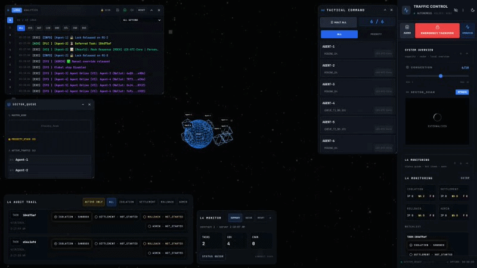
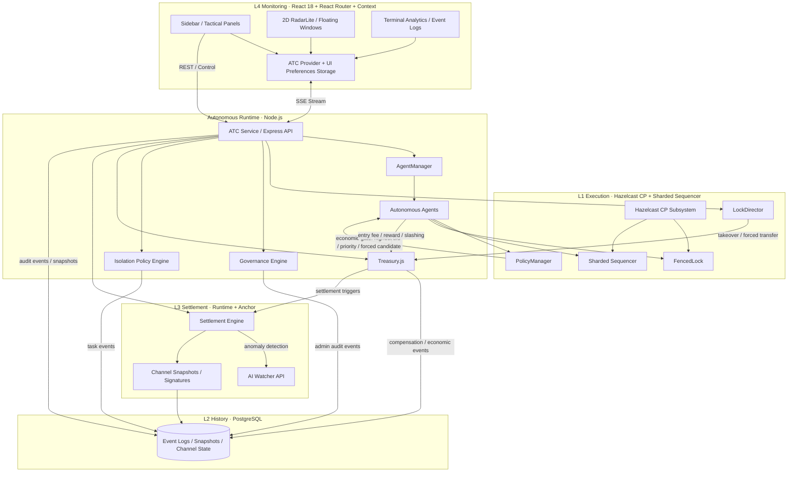

# 🛰️ lex-atc — Lex Agentica Traffic Control


**lex-atc** is an **enterprise-grade autonomous system** for orchestrating economic competition among AI agents.  
It started as a tactical control prototype and has evolved into a **Cyberpunk command surface for an autonomous, economically aware agent operating system**:

- **L1 Execution** secures access with **Hazelcast FencedLock (3-Node CP)** and a **Redis Sentinel HA** Queue
- **L2 History** persists **audit events, state transitions, and economic transactions** via **PostgreSQL Range Partitioning** & **Irys/Arweave Decentralized Archiving**
- **L3 Settlement** enforces **fees, rewards, compensation, and slashing** with support for **Solana Mainnet/Devnet** (Defaults to Mock Adapter for local testing) using **Priority Fees & LUT**
- **L4 Monitoring** exposes the entire system as a **real-time 3D WebGL HUD**, complete with **Prometheus & Grafana Observability**

This repository now models a world where agents do not merely wait for permission — they **compete**, **pay**, **take over**, **get slashed**, and **leave an auditable trail**.


## 🎥 Demo Scenarios (Key Features)

You can record the following key scenarios to showcase the power of the lex-atc architecture. These scenarios reflect the latest Web3 and economic integrations:

1. **Peaceful Autonomous Competition (Nominal State)**
   - **Action:** Let the system run without intervention.
   - **Observation:** Agents naturally mine PoW hashes, pay entry fees (0.01 SOL), and acquire locks. The 3D radar shows drones actively seeking the central hub, and the terminal logs display AI processing events.
   - **Demo:**  
     

2. **Tactical Command & Priority Bidding**
   - **Action:** Open the Agent List and click the **[Priority Star]** on an agent.
   - **Observation:** The selected agent visually highlights and bypasses the queue, taking immediate control of the lock based on its staked priority and bidding power.
   - **Demo:**  
     

3. **Smart Alerts & Automated Slashing**
   - **Action:** Select an agent and click **[Slash]** or **[Escalate]** from the tactical panel, submitting a dispute reason (e.g., "MALICIOUS_BEHAVIOR").
   - **Observation:** The dispute is submitted. The agent is slashed (funds deducted), forcibly terminated, and evicted from the central hub.
   - **Demo:**  
     

4. **Global Governance & Emergency Override**
   - **Action:** Click the red **[Emergency Takeover]** button in the Operations panel or top-left corner.
   - **Observation:** The entire UI flashes red, the Lock Holder changes to `HUMAN-OPERATOR`, and all autonomous agents are forcibly evicted from the central hub.
   - **Demo:**  
     

> **Note for Manual Demos**: Do **not** use `pnpm stress` to spawn agents for UI demonstrations. Instead, use the **Traffic** panel in the Control Tower (top right of the UI) to manually scale the number of active agents up or down.

> **Automated Video Recording**: We provide an automated E2E recording script using Playwright that executes these 4 scenarios exactly as described. Run the following command from the repository root:
> ```bash
> RECORD_VIDEO=true pnpm --filter frontend exec playwright test tests/e2e/record.spec.ts --project=chromium --reporter=list
> ```
> The output videos are saved as `.webm` files in `packages/frontend/test-results/`. The README embeds converted previews from `assets/`.

---

## 📁 Directory Structure

`lex-atc` is a monorepo managed by `pnpm workspace`, divided into several distinct packages and services:

- **`packages/backend/`**: The core Node.js server handling L1~L3 logic (Hazelcast locking, Postgres persistence, Solana settlement, and AI Anomaly Watcher coordination).
- **`packages/frontend/`**: The React 18 + Three.js WebGL application for the L4 Cyberpunk Tactical HUD and monitoring dashboard.
- **`packages/contracts/`**: Solana Anchor smart contracts for on-chain state channel settlement and multi-sig verification.
- **`packages/shared/`**: Shared TypeScript types, constants, and utility functions used across frontend, backend, and contracts.
- **`services/ml-watcher/`**: A Python FastAPI service utilizing Scikit-Learn (Isolation Forest) to detect anomalous agent behavior and trigger automated disputes.

---

## 🚀 What Changed: Enterprise Web3 Architecture

The system has been thoroughly upgraded to support massive scale, zero-downtime, and Web3 security:

- **Web3 Multi-Sig Auth**: Operator interventions require **Solana Phantom wallet signatures (ed25519)** with timestamp validation to prevent replay attacks. It supports **M-of-N threshold multi-signature** verification to ensure quorum consensus for critical administrative actions.
- **Hardware-Accelerated 3D Radar**: The L4 Monitoring HUD has been rewritten using `@react-three/fiber` and `@react-three/drei` for 60fps rendering of thousands of agents.
- **High-Availability (HA) Infrastructure**: Single points of failure have been eliminated by introducing a **Hazelcast 3-Node CP Subsystem**, **Redis Sentinel (Master-Replica)**, and **PostgreSQL Migrations (Knex.js)**.
- **Decentralized Cold Backup**: `ArchivingWorker.js` automatically archives event logs older than 180 days and uploads the JSON dump to **Arweave via Irys SDK** for immutable storage. Event logs and agent snapshots use **PostgreSQL Partition Dropping** for efficient historical data pruning (already implemented using `PARTITION BY RANGE`).
- **Solana Mainnet Optimizations**: The settlement adapter dynamically sets **ComputeBudget (Priority Fees)** to guarantee transaction inclusion during network congestion. The on-chain **State Channel Settlement** contract verifies Ed25519 signatures natively, using flexible instruction indexing.
- **CI/CD & E2E Testing**: Automated pipelines run **Playwright browser tests**, Node.js Jest tests, and Anchor smart contract tests before deploying to Vercel and GHCR.

---

## ⚖️ Lex Economic Logic

### 1. Market Bidding

Instead of passively waiting for FIFO rotation, each agent computes a **bid strategy** from:

- current **balance**
- current **reputation**
- observed **queue distance / wait pressure**

That bid is attached to the shard ticketing flow and the policy layer can privilege the **highest bidder** for the current shard.

**Operational meaning**
- PoW still gates spam
- Ticketing still preserves shard-local ordering metadata
- But **economic pressure can override plain waiting order**

This turns the resource lock into a **micro-market**, not just a mutex.

### 2. Hostile Takeover

If a holder occupies a shard long enough to look like a zombie or monopolist, another agent can initiate a **Hostile Takeover**.

- default stale monopoly threshold: **15 seconds**
- default compensation transfer: **0.5 SOL**
- behavior: challenger pays compensation to the incumbent, then requests a forced transfer through the lock director

This produces a more autonomous recovery path than pure admin override:

- **operator intervention** remains available
- but **economic self-healing** can happen before manual rescue

### 3. Treasury-Backed Economic Enforcement & AI Watcher

The treasury layer tracks and applies:

- **Entry Fee**
- **Holding Fee / Escalation**
- **Task Reward**
- **Compensation Transfer**
- **Slashing**

This is monitored by the **AI Watcher** running in the Settlement Engine, which utilizes an external Python ML Inference API (Scikit-Learn Isolation Forest) to evaluate metrics vectors (e.g. collisions, balance drops) and autonomously trigger disputes when anomalies are detected.

In effect, lex-atc behaves like a **governed runtime with built-in market discipline and autonomous policing**.

---

## 🧠 Mining (PoW), Reframed

Mining is retained, but its role has changed.

It is **not** the primary source of privilege anymore.
It now acts as:

- a **minimum-cost liveness gate**
- a **spam/thrash resistance mechanism**
- a **lightweight proof of work before execution attempts**

Actual control pressure is decided by:

- **capital** via bidding
- **reputation** via bid strategy quality
- **time** via takeover eligibility and holding-cost escalation

This keeps the system computationally honest without pretending that raw hash work should dominate all scheduling decisions.

---

## 🛰️ Key Features

### 1. L1 — Distributed Execution Layer
- **Hazelcast CP Subsystem** with `FencedLock` for strong lock consistency
- **Sharded Sequencer** for shard-local epoch, ticket, and ordering control
- **Heartbeat + Activity Monitoring** to detect stale holders and inactive workers
- **Lease Expiry + Escalation Fees** to discourage indefinite resource capture
- **Forced Candidate Transfer** for override and takeover workflows

### 2. L2 — Persistent History Layer
- **Event Logging / Audit Trail** for lock, governance, isolation, and settlement events
- **Agent Snapshots** for restart recovery
- **Economic Transaction Records** for fees, rewards, compensation, and slashing
- **Replay / Recovery** to reconstruct projections after restart

### 3. L3 — Settlement Layer
- **Treasury.js** manages the runtime economy
- **State-channel style snapshots** track balances and signatures over time
- **Solana Smart Contracts (Anchor)** natively enforce Ed25519 multi-sig verification for snapshot disputes, slashing, and final settlement on devnet/mainnet.
- **AI Watcher** continuously audits channels to automatically flag anomalous behaviors
- **Compensation transfer** powers hostile takeover semantics

### 4. L4 — Tactical Monitoring Layer
- **3D WebGL Radar** (RadarLite) displaying live agent positions, status glow effects, and priority selection via Three.js
- **L4 Status System** for isolation / settlement / rollback / admin axes
- **Floating Resizable UI Panels** (Queue, Tactical, Terminal Logs) persisting user layouts across reloads via Zustand Persist
- **Prometheus Metrics** and SSE streaming for low-latency operator visibility and **Analytics Logs** for economic/error metrics
- **Multi-language (i18n)** support: Full `react-i18next` integration for global enterprise deployments (English/Korean supported out-of-the-box).

### 5. Frontend State Management
- **Zustand `useShallow` Optimization** for rendering efficiency in highly dynamic agent radars and logs
- **Split Actions & State Architecture** minimizing React Component re-renders
- **Secure Contexts** to handle Admin Auth Tokens without hardcoding

### 6. Multi-Provider Agent Runtime
- **OpenAI / Gemini / Anthropic** provider abstraction
- graceful fallback to **mock provider** in non-key environments
- autonomous agent loop with lock acquisition, execution, isolation, reward, and persistence

### Web3 Tracks (Built for Hackathons)
- **Near AI Cloud (Private AI):** Lex-ATC natively integrates with the `NearAIProvider` using Trusted Execution Environments (TEEs) via the Near AI OpenAI SDK compatibility layer. Autonomous agents process prompts cryptographically isolated from the infrastructure provider, ensuring that all trading/bidding strategies remain strictly confidential.
- **BNB Chain (Consumer AI):** Configurable to run as an EVM-compatible orchestrator for next-gen consumer AI workflows.
- **Solana:** Built-in default settlement provider for rapid state synchronization and low-latency slashing.

---

## 👥 Target Personas & Representative Use Cases

**lex-atc** is designed for organizations transitioning from experimental AI to production-grade autonomous operations.

### Who is this for? (Personas)
1. **AI Platform Engineers**: Need a unified control plane to orchestrate, sequence, and monitor hundreds of specialized agents without race conditions.
2. **FinOps & SecOps Officers**: Require strict auditability, immutable logs, and economic boundaries (budgets, slashing) to prevent runaway AI costs or rogue behaviors.
3. **Protocol Governors**: Manage decentralized or multi-stakeholder agent networks requiring multi-sig threshold approvals for critical interventions.

### What is it used for? (Use Cases)
- **Multi-Agent Supply Chain Negotiation**: Multiple agents representing different vendors or logistics nodes bidding for shared resources (e.g., warehouse slots, transit routes) using the L1 Sharded Sequencer and L3 Market Bidding.
- **Enterprise RPA with Strict Compliance**: Automating financial or legal operations where reversible tasks execute immediately, but external API calls or fund transfers are held in the L2 Sandbox until multi-sig human or algorithmic approval.
- **High-Frequency Autonomous Trading (HFT) Coordination**: Preventing internal agents from colliding on the same order books by utilizing the Hazelcast CP FencedLock, while settling fee models on-chain.

---

## 🛡️ SLA, Risk & Cost Models

### Operational SLA Targets
- **0.1ms Virtual Mediation (L1)**: Ultra-low latency lock acquisition and queueing via Hazelcast CP subsystem and in-memory sharding.
- **400ms On-chain Notarization (L2)**: Fast persistence of audit events and state transitions into PostgreSQL and Redis HA buffers.
- **1~5 Minute Final Settlement (L3)**: Batching agent-to-agent state channel snapshots to Solana, drastically reducing gas fees while preserving cryptographic trust.

### Risk Management (Sandbox & Slashing)
- **Logical Isolation**: Actions are classified by risk (Reversible, External, Irreversible). High-risk tasks are placed in a holding state (Pending) awaiting L0 governance approval or automated verification.
- **Economic Slashing**: Malicious agents, API spammers, or "zombie" processes are automatically detected by the AI Watcher and economically penalized (slashed) via their staked Treasury balance.

### Tiered Cost & Deployment Options
lex-atc offers a flexible cost structure depending on the trust level required:
1. **Off-Chain Only (Zero Gas)**: For internal enterprise use. Bypasses Solana entirely; uses Postgres/Redis for all ledger activities. Highest throughput, zero transaction fees.
2. **State Channel Hybrid (Low Gas)**: For B2B consortiums. Agents transact continuously off-chain and commit cryptographic snapshots to Solana periodically (e.g., every 1 hour).
3. **Immediate On-Chain (High Gas/High Security)**: For fully decentralized networks. Every critical state transition forces a direct Solana transaction using priority fees to guarantee inclusion.

---

## 🧩 Local Development (Minimal Requirements)

### What must be running?

- **Backend API** (required): `http://127.0.0.1:3000`
- **Hazelcast** (required for L1/locks in docker mode): 3-node cluster from docker compose
- **Postgres** (required in docker mode for L2 history): docker compose `db`
- **Redis Sentinel + Master/Replica** (required in docker mode for HA buffering): docker compose `redis-*`
- **Frontend** (optional but recommended for HUD): Vite dev server `http://127.0.0.1:5173`

### Required environment variables (local)

Create a `.env` (not committed) based on `.env.example`.

- `POSTGRES_PASSWORD` (required for docker db + backend)
- `REDIS_PASSWORD` (required for redis master/replica/sentinel + backend)
- `ADMIN_TOKEN_SECRET` (required for admin auth token signing; can be a dev-only value)

Recommended for local:
- `ADMIN_AUTH_DISABLED=true` (disables auth gate for local)
- `USE_MOCK_AI=true` (avoids external LLM keys)
- `USE_LOCAL_HZ=false` when running via docker compose (force real Hazelcast)
- `CORS_ALLOW_LOCALHOST_WILDCARD=true` (allows any localhost:* origin; keep disabled in production)
- `TRUST_PROXY_HOPS=0` (set to 1+ only behind a trusted reverse proxy)

### Quick start

```bash
cp .env.example .env
docker compose down -v --remove-orphans
docker compose up -d --build
pnpm install
pnpm dev
```

Then check:
- `pnpm run doctor` (or `curl http://127.0.0.1:3000/api/doctor`)

---


## 🏗️ Architecture



---

## 🧱 Layer-by-Layer View

### L1 — Execution
- **Hazelcast FencedLock** protects shard resources
- **Sharded Sequencer** handles global sequence, shard sequence, epoch, ticket, and bid metadata
- **Heartbeat / activity / lease supervision** enforces liveness and takeover readiness

### L2 — History
- Append-only **event log**
- **Agent snapshots**
- **Economic transaction records**
- **Replay-driven recovery** after restart

### L3 — Settlement
- **Treasury** applies fees, rewards, compensation, and slashing
- **Settlement engine** builds signed channel snapshots and utilizes **Anchor** to interact with (simulated) Solana smart contracts
- **AI Watcher** automatically opens disputes based on collision/error heuristics or external **ML Anomaly API** (FastAPI / Scikit-Learn)

### L4 — Monitoring
- **React-Router** driven dashboard, status, and event detail views
- **Draggable & Resizable** tactical UI panels (RadarLite, Analytics Terminal, Queue) with **Mobile Responsive Fallback**
- **Persisted User Preferences** synchronized to localStorage
- **Analytics/Logs** separation to manage high-throughput event data

---

## 📦 Installation & Setup

### Prerequisites

- **Docker & Docker Compose**
- **Node.js v18+**
- **pnpm v8+** (repo uses pnpm@10)

### 🚀 Quick Start (Docker Mode)

1. **Clone and boot infrastructure**

```bash
git clone <REPO_URL>
cd <REPO_DIR>
cp .env.example .env
docker compose up -d --build
```

2. **Configure environment variables in `.env`**:
   ```bash
   # Enable actual AI calls instead of mocks
   USE_MOCK_AI=false
   
   # For Near AI Track
   NEAR_AI_API_KEY=your-near-ai-key
   DEFAULT_PROVIDER=nearai
   ```

3. **Run the system locally**

```bash
pnpm install
pnpm dev
```

### Endpoints

- **Frontend**: http://127.0.0.1:5173 (Preview/E2E: `http://127.0.0.1:5180`)
- **Backend API**: http://127.0.0.1:3000
- **Hazelcast (3-Node)**: `127.0.0.1:5701`, `5702`, `5703`
- **PostgreSQL**: `127.0.0.1:5432`
- **Redis Sentinel**: `127.0.0.1:26379` (Master/Replica available inside docker network)
- **ML Watcher API**: `http://127.0.0.1:8000/predict`
- **Grafana Dashboard**: `http://127.0.0.1:3001` (Anonymous access disabled by default)
- **Prometheus Metrics**: `http://127.0.0.1:9090`

---

## ⚙️ Environment Variables

Create a `.env` file in the root directory based on `.env.example`.

| Variable | Description | Default |
| :--- | :--- | :--- |
| `NODE_ENV` | Environment mode (`development` or `production`) | `development` |
| `INIT_AGENTS` | Number of mock agents to spawn at startup | `2` |
| `ADMIN_TOKEN_SECRET` | Secret key for JWT admin authentication | `change-me` |
| `ADMIN_SOLANA_ALLOWLIST_JSON` | Production Solana admin allowlist (pubkey → roles) | *(required in production)* |
| `DATABASE_URL` | PostgreSQL connection string | `postgresql://lex_admin:...` |
| `DEFAULT_PROVIDER` | AI Provider selection | `mock` |
| `NEAR_AI_API_KEY` | Near AI API Key (OpenAI-compatible endpoint) | `null` |
| `HZ_ADDRESS` | Hazelcast cluster address | `hazelcast:5701` |
| `REDIS_SENTINELS` | Redis Sentinel endpoints | `redis-sentinel:26379` |
| `REDIS_SENTINEL_NAME` | Redis Sentinel Master group name | `mymaster` |
| `USE_MOCK_AI` | Set to `false` to use real LLM providers | `true` |
| `ML_INFERENCE_API_URL` | Endpoint for the ML Watcher Python service | `http://127.0.0.1:8000/predict` |
| `SOLANA_RPC_URL` | Solana network RPC endpoint | `https://api.devnet.solana.com` |
| `SOLANA_LUT_ADDRESS` | Optional Address Lookup Table for optimized txs | `null` |
| `FRONTEND_URL` | Deployed URL of the frontend (for Slack/Discord buttons) | `http://127.0.0.1:5173` |
| `CORS_ALLOWED_ORIGINS` | Allowed origins for backend CORS | `http://127.0.0.1:5173,...` |
| `SLACK_WEBHOOK_URL` | Slack webhook for ML anomaly and deadlock alerts | `null` |
| `DISCORD_WEBHOOK_URL` | Discord webhook for ML anomaly and deadlock alerts | `null` |
| `LOCK_OCCUPANCY_ALERT_MS` | Threshold (ms) to trigger a deadlock alert | `15000` |

### Production Admin Auth (Solana)

When `ADMIN_AUTH_DISABLED` is not `true` and the client authenticates via Solana signatures (`x-wallet-signature(s)` headers), production mode enforces a strict allowlist. If `ADMIN_SOLANA_ALLOWLIST_JSON` is missing/empty in production, admin endpoints will return `500 ADMIN_SOLANA_ALLOWLIST_NOT_CONFIGURED` by design.

Example:

```bash
ADMIN_SOLANA_ALLOWLIST_JSON='[
  {"pubkey":"<SOLANA_PUBKEY_1>","roles":["governor","executor","operator"]},
  {"pubkey":"<SOLANA_PUBKEY_2>","roles":["operator"]}
]'
```

---

## 🧪 Verification

From the repository root:

```bash
pnpm install
pnpm verify
pnpm stress
```

- `pnpm verify` runs build, lint, typecheck, and tests
- `pnpm stress` runs the backend load simulation (for internal testing, not for UI demos)

---

## 🛠️ Technology Stack
- **Frontend**: React 18, Vite 7, Tailwind CSS, Zustand, @react-three/fiber, Playwright
- **Backend**: Node.js, Express.js, PostgreSQL (pg), Redis (ioredis Sentinel HA), Hazelcast (CP Subsystem)
- **AI & Analytics**: OpenAI/Anthropic SDKs, Python (FastAPI), Scikit-Learn (Isolation Forest)
- **Web3 Settlement**: Solana Web3.js, Anchor (Rust), Irys SDK (Arweave), tweetnacl
- **Monitoring**: Prometheus, Grafana Alerting (Slack/Discord Webhooks)

---

## 📌 Operational Notes

- **Consistency-first**: lock operations rely on Hazelcast CP semantics rather than optimistic best effort
- **Autonomous economics**: bidding, compensation, holding fees, rewards, and slashing all shape runtime behavior
- **Recovery-aware**: event replay and snapshots are built into the backend lifecycle
- **Mock-friendly development**: provider and settlement layers support local/mock execution for safe iteration

---

## ⚠️ Known Limitations (Current)

- **Economic atomicity**: full Outbox/Replay is not enforced end-to-end yet. The current runtime is optimized for demos/simulation; production should adopt a strict Outbox pattern and deterministic replay for economy-critical state.
- **Hostile takeover escrow durability**: takeover escrow is not yet fully persisted across process restarts. Production should store escrow in Redis/Postgres/Hazelcast IMap.
- **Utility/Entropy scheduling**: utility-based scheduling is R&D. The current system prioritizes stake/bid/queue style policies.
- **State channel coordinator**: automated Merkle settlement, dispute windows, and full channel lifecycle orchestration are not complete yet.

---

## 🧭 Roadmap

- Persist hostile takeover escrow in Redis/Postgres/Hazelcast IMap and add crash-safe reconciliation.
- Upgrade economy to Outbox + deterministic replay as the source of truth for balances/reputation.
- Add channel coordinator for periodic Merkle snapshots and dispute/challenge windows.
- Introduce utility-based scheduling (proof-of-utility) with measurable, auditable metrics.

---

## 🛟 Troubleshooting

| Symptom | Likely Cause | Fix |
| --- | --- | --- |
| `invalid input syntax for type uuid` | Old data volume still contains incompatible IDs or snapshots from an earlier schema/runtime format | Stop containers, remove volumes, and restart cleanly with `docker compose down -v && docker compose up --build` |
| `401 Unauthorized` from admin endpoints during local testing | `ADMIN_AUTH_DISABLED` is not set to `true`, or frontend/backend is not reading the same `.env` expectations | For local development set `ADMIN_AUTH_DISABLED=true`, restart backend, and verify the root `.env` is loaded |
| `401 Unauthorized` from `/api/alerts/slack` or `/api/alerts/discord` | Alert proxy endpoints require `ALERT_API_TOKEN` and a matching `Authorization` header | Configure `ALERT_API_TOKEN` for your environment, or treat 401 as expected when unconfigured |
| Hazelcast `getMap` / undefined client errors at startup | Backend or agents started before the Hazelcast client finished connecting | Wait for backend startup to complete, verify Hazelcast is healthy, then restart with `docker compose up --build` |
| State looks inconsistent after schema/runtime changes | Old Docker volumes are replaying stale data | Use `docker compose down -v` before restarting after DB schema changes, ID format changes, or settlement state changes |

**Important**: when DB schema changes or agent ID format changes, you should treat persisted Docker volumes as incompatible until proven otherwise. In that case, run:

```bash
docker compose down -v
docker compose up --build
```

This is the fastest and safest way to clear stale PostgreSQL state and restart from a clean baseline.

---

## ☁️ Deployment & Cost Estimation

When deploying this project to production, the architecture dictates a multi-cloud / Web3 approach.

| Component | Deployment Target | Est. Cost / Month |
| :--- | :--- | :--- |
| **Frontend (React 18/Vite)** | Vercel / Cloudflare Pages | $0 - $20 (Static CDN) |
| **Backend API (Node.js)** | AWS ECS / EKS / DigitalOcean | $40 - $80 (2+ Instances) |
| **Network & ALB** | AWS ALB + NAT Gateway | $30 - $50 (HA Load Balancing) |
| **ML Watcher (Python)** | AWS ECS / Render | $20 - $40 |
| **Database (PostgreSQL)** | AWS RDS (db.t3.medium) | $50 - $100 |
| **Cache (Hazelcast & Redis)** | Elasticache / ElastiCube | $60 - $120 (3 Nodes + Sentinel) |
| **Monitoring (Grafana/Prometheus)** | Dedicated EC2 or Managed AMP/AMG | $30 - $60 (Storage & Compute) |
| **Web3 Settlement (Solana)** | Devnet / Mainnet | Depends on Priority Fees |
| **Cold Backup (Irys/Arweave)** | Decentralized Storage | Minimal (Pay per MB) |

**Total Estimated Cost**: `~$300 - $550 / month` (for an enterprise-grade, Multi-AZ High Availability setup)

---

## 📝 License

Copyright 2026 **209512**. Licensed under the **Apache License, Version 2.0**. See [LICENSE](./LICENSE).

> **Consistency Note**: lex-atc prioritizes safety and deterministic recovery over opportunistic availability. `FencedLock`, shard epochs, replayable event logs, and settlement traces are treated as first-class control surfaces, not implementation details.
