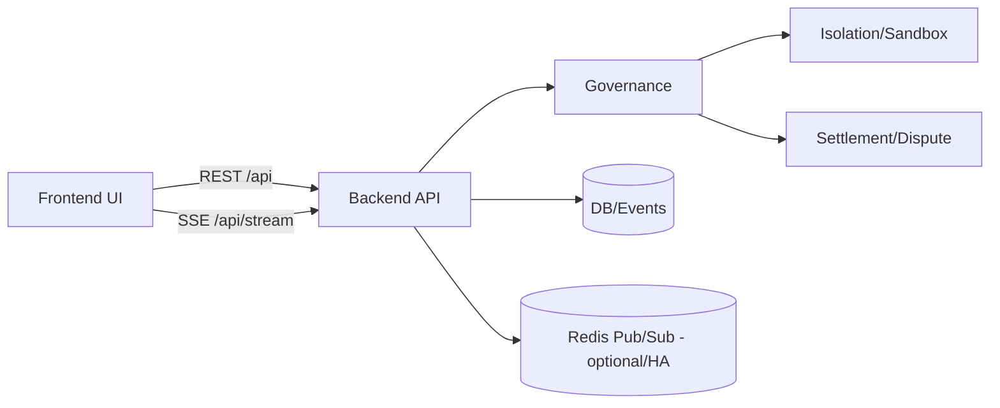

# 🛰️ lex-atc — Lex Agentica Traffic Control

English | [한국어](./README.ko.md)

## Motivation

This project started from a simple question that emerged after building an earlier ATC prototype:
when multiple organizations run their own AI agents and those agents must collaborate on a shared artifact/resource,
**who gets priority**, **who decides that rule**, and **is the decision fair and verifiable**?

lex-atc explores an agent orchestration runtime that treats priority and intervention as **auditable governance and settlement events** — not only as opaque operator discretion.

Background: [docs/motivation.md](./docs/motivation.md)

## Core Values

- Consistency-first: correctness over best-effort progress during contention
- Auditability: every intervention and policy decision should be explainable from logs
- Safety by design: fail-fast config guards and clear mode boundaries

## Non-goals

- Not “blockchain for everything”; settlement is a tool, not the product
- Not a generic LLM agent framework; focus is contention control and verifiable coordination

## Operating Modes

| Mode | Purpose | Backend Required | Notes |
| --- | --- | --- | --- |
| Standalone (MSW Simulation) | Demo / simulation | No | MSW + simulated events in the browser. Not 1:1 with production latency/auth/failure |
| Backend Mode | Real runtime | Yes | Uses real API/SSE. Suitable for production-like verification |

## Architecture



| Area | Where | Notes |
| --- | --- | --- |
| UI | `packages/frontend` | Monitoring/ops UI, MSW standalone simulation |
| Backend | `packages/backend` | API/SSE + runtime (agents/governance/isolation/settlement) |
| Shared | `packages/shared` | Shared schemas/types/contracts for API/SSE |
| Full doc | [docs/architecture.md](./docs/architecture.md) | Mode flows and operational request flow |

## Quick Start

### 1) Standalone (Frontend Only)

```bash
pnpm install
pnpm dev:standalone
```

Vercel production env:

- `VITE_ENABLE_MSW=true`
- `VITE_API_URL=/api`

Standalone mode requires Service Worker. If SW is blocked, it cannot function.

### 2) Backend Mode (Local)

```bash
pnpm install
pnpm dev:backend
```

## Determinism (Local)

To keep wallets stable across restarts:

- set `AGENT_KEY_SEED` and `TREASURY_KEY_SEED`, or
- set `ALLOW_DEV_SEED_FALLBACK=true` (development default is true; set `ALLOW_DEV_SEED_FALLBACK=false` to force ephemeral seeds)

## Utility/Entropy Scheduling (R&D)

PoW or reputation-based priority can be biased depending on the environment and incentives. We treat utility/entropy-based scheduling as an R&D track and keep a working hypothesis that an **entropy-derived signal** (capturing uncertainty/diversity/unpredictability) can be a fairer input to scheduling and safety policies in some collaboration settings.

This is a hypothesis to be measured and iterated — not a final claim.

Roadmap and known limitations: [docs/roadmap.md](./docs/roadmap.md)

## Docs

- Docs index: [docs/README.md](./docs/README.md)
- Backend deployment: [packages/backend/DEPLOYMENT.md](./packages/backend/DEPLOYMENT.md)
- Frontend deployment/QA: [packages/frontend/DEPLOYMENT.md](./packages/frontend/DEPLOYMENT.md), [packages/frontend/QA_CHECKLIST.md](./packages/frontend/QA_CHECKLIST.md)

## Tests

```bash
pnpm -w verify
pnpm -C packages/frontend test:e2e
```
