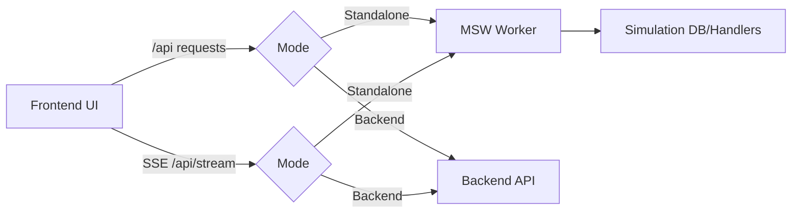
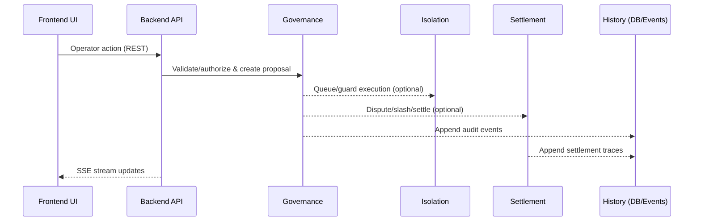
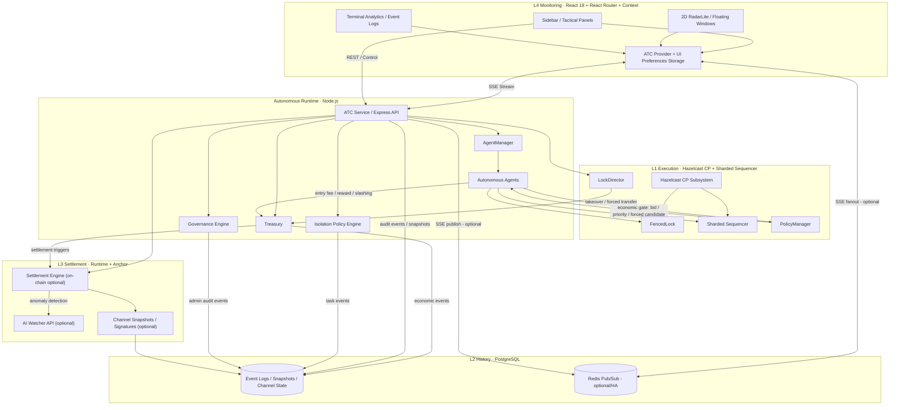

# 아키텍처

lex-atc는 UI(L4)와 백엔드 런타임(L1~L3)을 분리해 운영하는 구조를 기본으로 한다.

## 모드별 흐름

## 운영 요청 흐름

## 레이어

- L4: React/Vite 기반 모니터링·운영 UI
- L1: [Lock](./glossary.md#lock)/Sequencer/정책 실행 계층(Hazelcast/FencedLock 등)
- L2: 이벤트/스냅샷/감사로그 저장(Postgres/Redis)
- L3: [Settlement](./glossary.md#settlement)/[Dispute](./glossary.md#dispute)/서명·증명(Solana/Anchor, 로컬은 Mock adapter)

## 패키지

- `packages/frontend`: UI, 운영 패널, MSW 기반 Standalone simulation
- `packages/backend`: API/[SSE](./glossary.md#sse), 런타임(agents/governance/isolation/settlement)
- `packages/contracts`: Solana Anchor 프로그램/테스트
- `packages/shared`: 공용 타입/스키마
- `services/ml-watcher`: 이상행동 감지(옵션)

## 메모

- Standalone(MSW) 모드는 데모/시뮬레이션에 최적화된 모드이며, 운영 환경의 권한·지연·실패 패턴을 1:1 재현하지 않는다.
- Backend mode는 실제 운영 리스크를 검증하는 모드이며, 운영 배포 전 반드시 이 모드에서 확인하는 것을 권장한다.

## 전체 시스템 다이어그램(개념)

- Redis Pub/Sub은 단일 인스턴스에서는 필수 구성은 아니며, 다중 인스턴스/SSE 퍼블리셔 리더십을 위해 권장되는 선택 구성이다.
- On-chain(Anchor/메인넷)은 운영 환경변수로 활성화되는 선택 구성이고, 로컬/테스트에서는 Mock adapter로 동작할 수 있다.
- ML Watcher는 `ML_INFERENCE_API_URL`이 설정된 경우에만 외부 API 호출을 수행하는 선택 구성이다.

### 옵션 구성 활성화 조건(ENV)

| 옵션 | 의미 | 활성화 조건(대표 ENV) |
| --- | --- | --- |
| Redis Pub/Sub | 다중 인스턴스에서 SSE fanout/리더십을 지원 | `REDIS_URL` 또는 `REDIS_SENTINELS` |
| ML Watcher | 정산/분쟁 관련 외부 추론 API 호출 | `ML_INFERENCE_API_URL` |
| On-chain settlement | 실제 Solana/Anchor 트랜잭션 수행 | `SOLANA_SETTLEMENT_ENABLED=true` + `SOLANA_RPC_URL` (+ `SOLANA_PROGRAM_ID` 등) |
