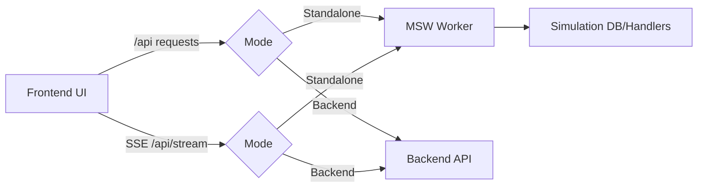
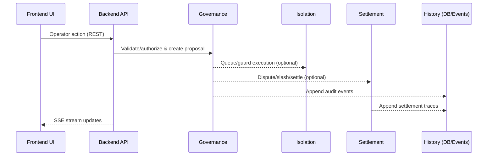

# Architecture

lex-atc는 UI(L4)와 백엔드 런타임(L1~L3)을 분리해 운영하는 구조를 기본으로 한다.

## Mode Flows

## Operational Request Flow

## Layers

- L4: React/Vite 기반 모니터링·운영 UI
- L1: [Lock](./glossary.md#lock)/Sequencer/정책 실행 계층(Hazelcast/FencedLock 등)
- L2: 이벤트/스냅샷/감사로그 저장(Postgres/Redis)
- L3: [Settlement](./glossary.md#settlement)/[Dispute](./glossary.md#dispute)/서명·증명(Solana/Anchor, 로컬은 Mock adapter)

## Packages

- `packages/frontend`: UI, 운영 패널, MSW 기반 Standalone simulation
- `packages/backend`: API/[SSE](./glossary.md#sse), 런타임(agents/governance/isolation/settlement)
- `packages/contracts`: Solana Anchor 프로그램/테스트
- `packages/shared`: 공용 타입/스키마
- `services/ml-watcher`: 이상행동 감지(옵션)

## Notes

- Standalone(MSW) 모드는 데모/시뮬레이션에 최적화된 모드이며, 운영 환경의 권한·지연·실패 패턴을 1:1 재현하지 않는다.
- Backend mode는 실제 운영 리스크를 검증하는 모드이며, 운영 배포 전 반드시 이 모드에서 확인하는 것을 권장한다.
