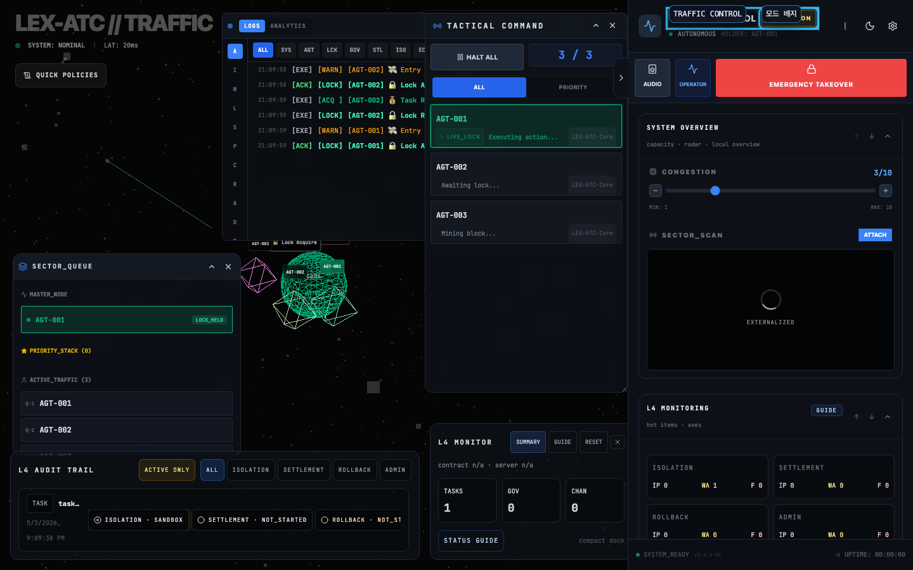
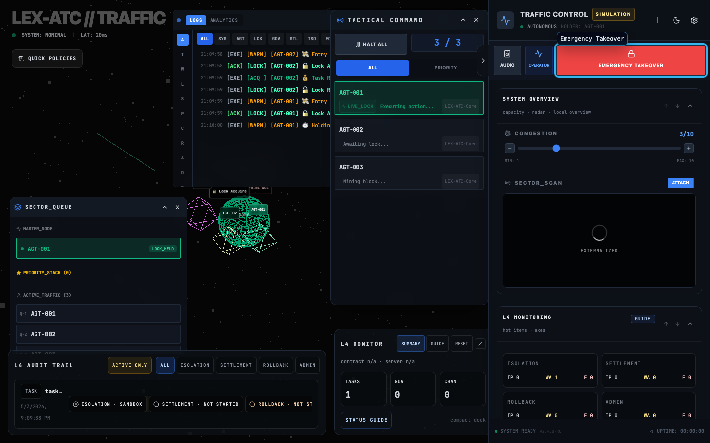
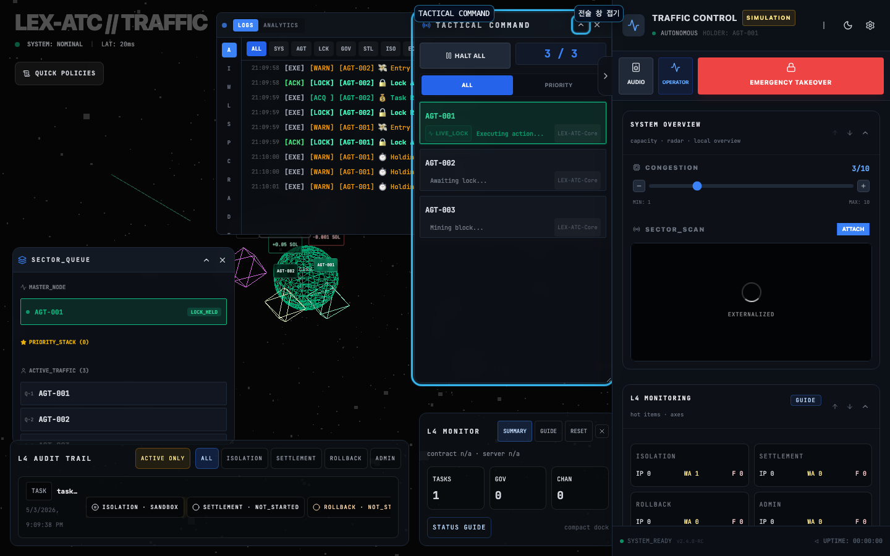
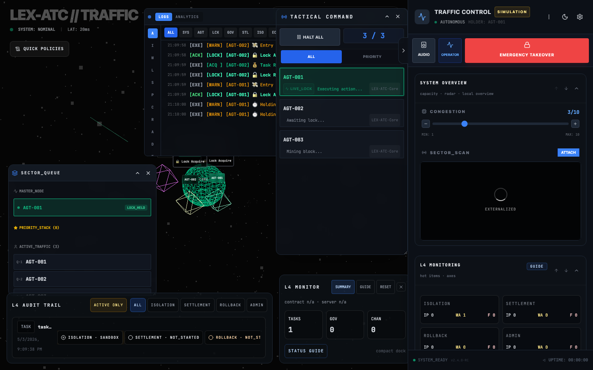
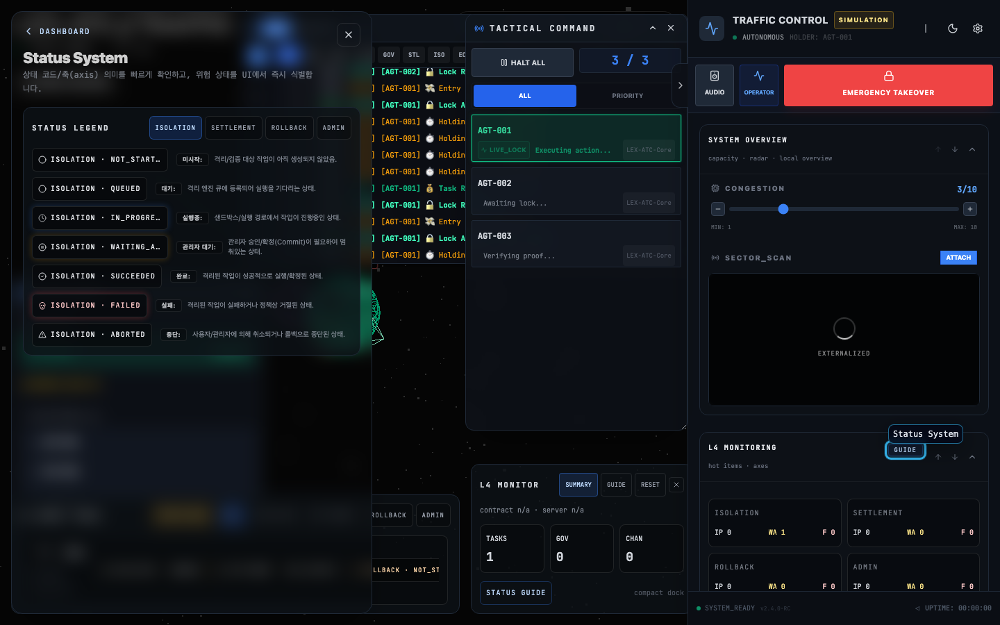
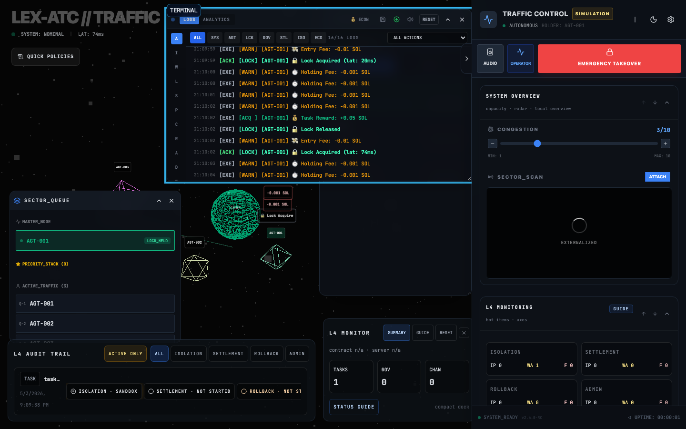
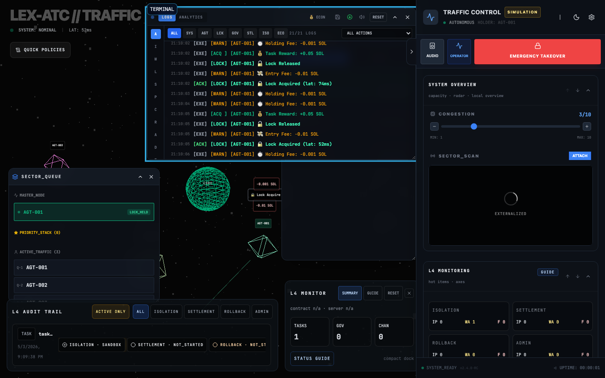
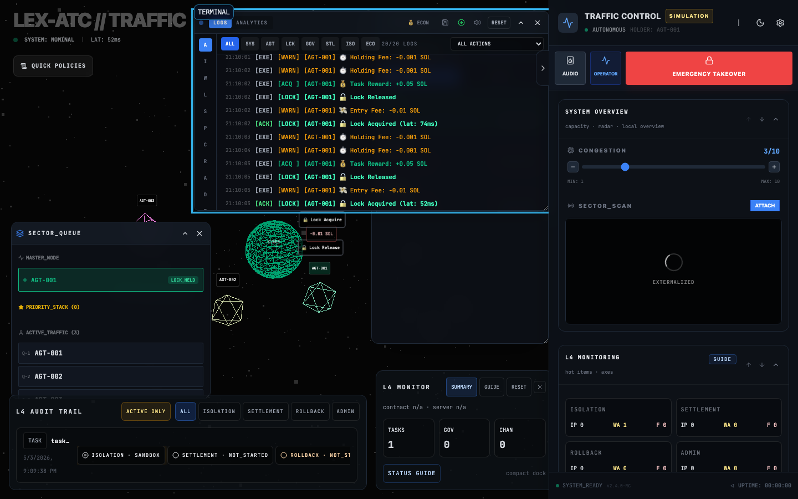

# UI 가이드(운영/모니터링)

목표: 처음 보는 사용자도 “무엇을 눌러야 하는지 / 무엇을 봐야 하는지”를 빠르게 이해하고, 운영자가 장애·분쟁 상황에서 최소한의 클릭으로 상태를 판단할 수 있게 한다.

## 1) 빠른 시작(처음 5분)

1) 좌측 상단 헤더(TRAFFIC CONTROL)에서 배지 2개를 먼저 확인한다.
- 모드 배지: `SIMULATION` 또는 `BACKEND` 또는 `BACKEND (FALLBACK)`
- SSE 배지: `SSE DOWN` 또는 `STREAM STALE`가 뜨면 스트림 상태가 비정상이다

2) 우측 상단(헤더)의 `System Settings` 버튼(⚙️)을 눌러 설정 패널을 열고, 현재 모드/연결 상태를 확인한다.

3) 화면에 패널이 안 보이면, 좌측 중앙에 뜨는 복원 버튼(`QUEUE`/`TACTICAL`/`TERMINAL`/`L4`)을 눌러 다시 연다.

## 2) 화면 구성

- Radar(메인 캔버스)
  - 에이전트의 위치/상태를 시각화한다.
- Sidebar(좌측 패널)
  - 시스템 상태, 에이전트 리스트, 운영 액션(Governance/Isolation/Settlement)을 제공한다.
- Floating panels(오버레이 패널)
  - `TERMINAL`(로그), `QUEUE`, `TACTICAL`, `L4`(Audit trail/Status system 관련)를 제공한다.

## 3) Sidebar 헤더(TRAFFIC CONTROL) 읽는 법

- 모드 배지
  - `SIMULATION`: 브라우저에서 MSW로 `/api`를 모킹(데모/시뮬레이션)
  - `BACKEND`: 실제 백엔드 API/SSE 사용
  - `BACKEND (FALLBACK)`: 설정 문제로 MSW가 꺼지고 백엔드 API로 fallback(운영에서는 권장하지 않음)
- SSE 배지
  - `SSE DOWN`: 스트림 연결이 끊김
  - `STREAM STALE`: 연결은 있으나 업데이트가 일정 시간 이상 도착하지 않음(`VITE_SSE_STALE_MS`)
- HOLDER / MANUAL OVERRIDE
  - `MANUAL OVERRIDE`가 표시되면 운영자(사람)가 개입한 상태로, 자동 경쟁 흐름과 다르게 보일 수 있다.



## 4) Control 버튼(사이드바 상단)

- `Audio`: 알림 음소거/해제
- `viewMode`: `operator` → `executive` → `focus` 순환(보이는 패널/강조가 달라진다)
- `Emergency Takeover` / `Release Lock`
  - `Emergency Takeover`: 운영자가 강제로 개입(위험/훈련/장애대응)
  - `Release Lock`: 개입 해제(정상 상태로 복귀)



## 5) Tactical Command(전술 패널) 사용법

패널 헤더: `Tactical Command`

- `HALT ALL` / `RESUME ALL`
  - 전체 에이전트의 일시정지/재개를 전환한다.
- 필터 `ALL` / `PRIORITY`
  - 우선권이 부여된 에이전트만 빠르게 보려면 `PRIORITY`를 사용한다.
- 에이전트 카드의 액션(마우스 오버 시 노출)
  - `Slash`: 분쟁/슬래싱 액션(운영 리스크가 높다)
  - `Priority`: 우선권 부여/회수
  - `Seize`: 락 강제 이전(조건 충족 시에만 활성)
  - `Pause/Resume`: 개별 에이전트만 정지/재개
  - `Terminate`: 에이전트 종료
  - `Rename Agent`: 라벨/표시 이름 변경

운영 팁
- `Seize`/`Slash`는 “원인 파악 → 기록 확인 → 실행” 순서로 진행하고, 실행 후에는 `L4 Audit Trail`과 Terminal 로그로 결과를 교차 확인한다.



## 6) Operations(운영 패널) 사용법

Sidebar 내 `Operations`는 3개 섹션으로 나뉜다.

- Governance
  - 제안(proposal) 생성/승인/자동 실행 흐름
- Isolation
  - `Emergency Stop` / `Resume`
  - `Finalize` / `Rollback` / `Cancel` (task 단위)
- Settlement
  - `Dispute` / `Slash` (channel 단위 또는 manual 입력)

운영 팁
- `accepted`(proposal accepted)와 `executed`(실행 완료)를 구분해서 본다.
- 실패 시에는 UI 토스트만 보지 말고 Terminal 로그의 `PROPOSAL_EXECUTION_FAILED` 또는 `..._FAILED` 메시지와 함께 본다.



## 7) L4 Audit Trail(이벤트)와 Status System

- L4 Audit Trail(패널 제목: `L4 Audit Trail`)
  - 우측 상단 필터:
    - `Active only`: 진행중/대기/실패 같은 “활성 이슈”만 보기
    - 축(axis) 필터: `isolation`, `settlement`, `rollback`, `admin`
  - 항목 클릭 시 `/events/:id` 상세 페이지로 이동한다.

- Status System(경로: `/status-system`)
  - 상태 축(axis)과 코드(code) 의미를 표준화해, “어떤 종류의 문제가 어디서 발생했는지”를 빠르게 분류한다.



## 8) Dispute/Slashing 패널(Heatmap) 해석

- `DISPUTE CONTEXT`
  - dispute가 열린 channelId/actor/nonce/reason을 요약한다.
- `SLASHING JUSTIFICATION`
  - 슬래싱 판단의 근거 지표를 요약한다(예: conflict rate, balance drain, anomaly score).

운영 팁
- 수치만으로 결론을 내리지 말고, 같은 시점의 `L4 Audit Trail`과 Terminal 로그를 같이 본다.

## 9) 운영 시나리오 런북(문제별 체크 순서)

### A) SSE DOWN

1) 헤더 배지에서 `SSE DOWN` 확인  
2) 모드 배지가 `BACKEND (FALLBACK)`인지 확인(설정 문제 가능)  
3) Backend Mode라면 백엔드 서버/프록시 상태를 확인하고, 네트워크/프록시 타임아웃 설정을 점검한다  
4) 복구 후, `STREAM STALE`이 남아 있지 않은지 확인한다

### B) STREAM STALE

1) `STREAM STALE` 확인  
2) `VITE_SSE_STALE_MS`가 너무 짧게 설정되어 있지 않은지 확인  
3) 인그레스/로드밸런서의 idle timeout과 재연결 주기를 함께 점검한다  
4) 동일 시점에 계약 위반/격리/정산 실패가 쌓이는지(L4/Terminal) 확인한다

### C) Dispute/Slash 실행 후 확인

1) `DISPUTE CONTEXT` 또는 `SLASHING JUSTIFICATION` 패널이 뜨는지 확인  
2) `L4 Audit Trail`에서 해당 축(settlement/isolation)의 상태가 변경됐는지 확인  
3) Terminal 로그에서 `SETTLEMENT_DISPUTE_*` / `SETTLEMENT_SLASH_*` 이벤트를 확인한다  
4) 반복 실행이 필요하다면, 원인(why)을 먼저 정리하고 같은 action을 중복 실행하지 않도록 한다





### D) Emergency Takeover

1) `Emergency Takeover` 실행 후 헤더에 `MANUAL OVERRIDE`/HOLDER 변화가 있는지 확인  
2) 필요한 조치를 수행한 뒤 `Release Lock`으로 정상 복귀  
3) 복귀 후, 자동 경쟁 흐름이 정상으로 돌아오는지(L4/Terminal) 확인한다

### E) Sandbox denial spike

1) Terminal에서 `SANDBOX_*` 또는 `SANDBOX_BINARY_NOT_ALLOWED`가 단시간에 반복되는지 확인  
2) deny reason이 allowlist/정책 파싱/키 미스매치인지 분류한다  
3) Backend 모드에서라면 `SANDBOX_ALLOWED_BINARIES` 및 `SANDBOX_COMMAND_POLICY_JSON`(옵션)을 점검한다  
4) 복구 후, 동일 deny가 재발하지 않는지 Terminal과 L4 이벤트로 확인한다



## 10) 수동 QA 체크리스트

- [packages/frontend/QA_CHECKLIST.md](../packages/frontend/QA_CHECKLIST.md)
- 데모 시나리오(짧은 재현): [demo.md](./demo.md)

## 11) 스크린샷 생성(유지보수용)

문서 스크린샷은 Playwright로 자동 생성한다:

```bash
pnpm --filter frontend exec node scripts/capture-docs-screenshots.mjs
```
